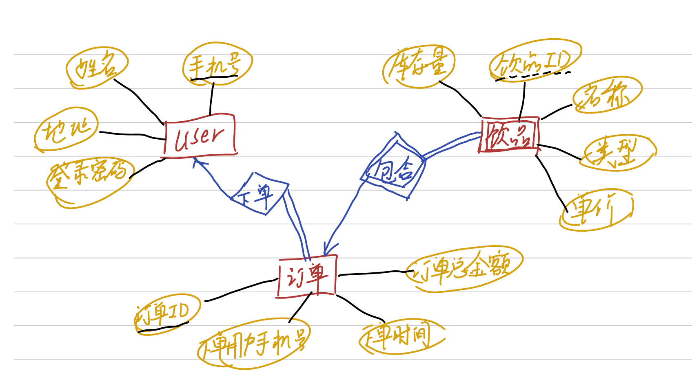
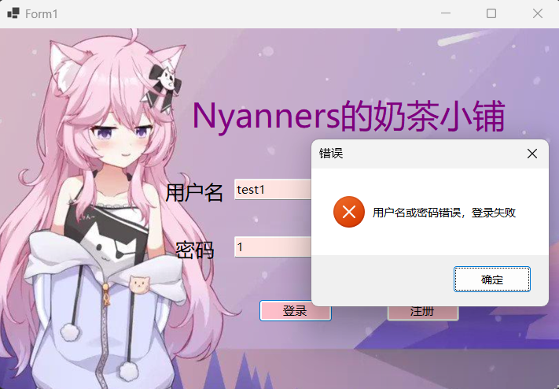
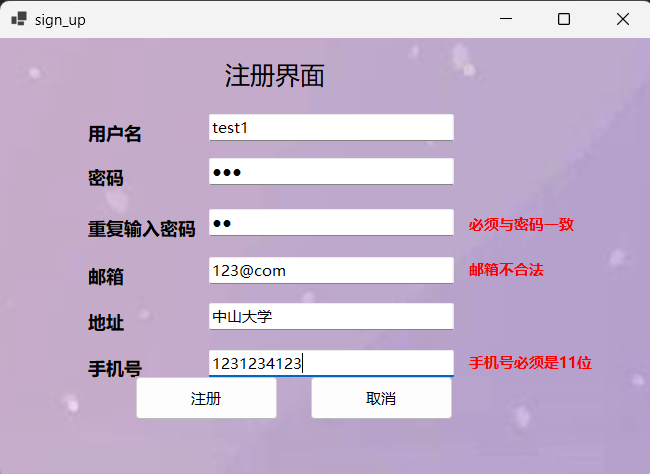
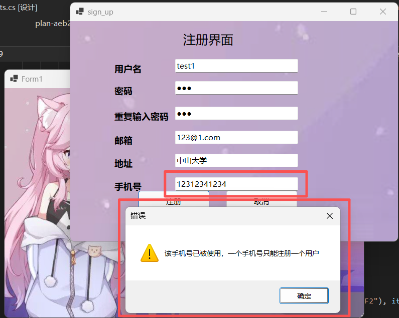
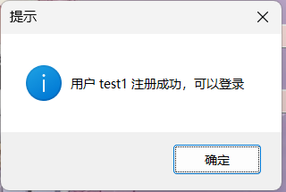
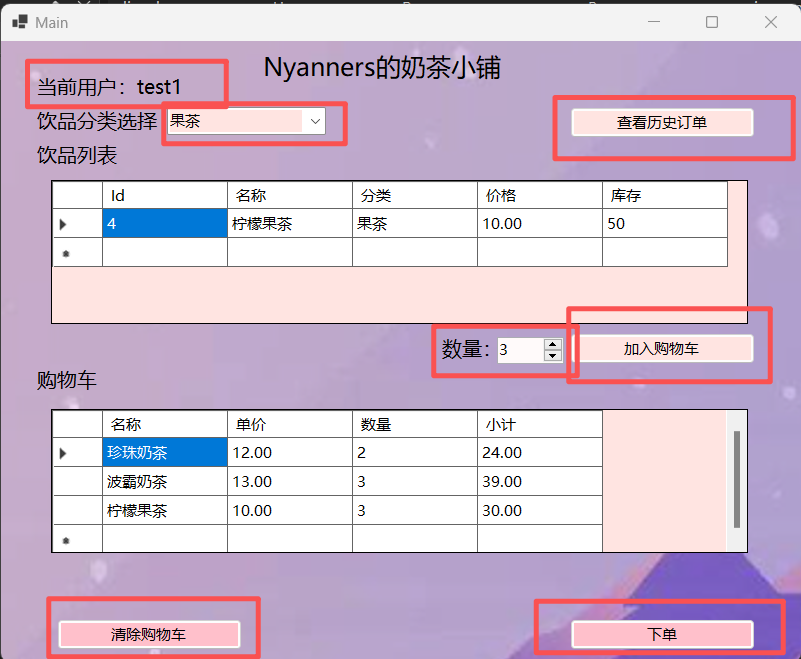
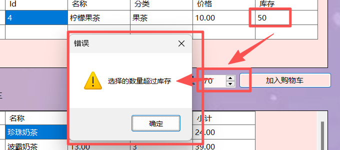
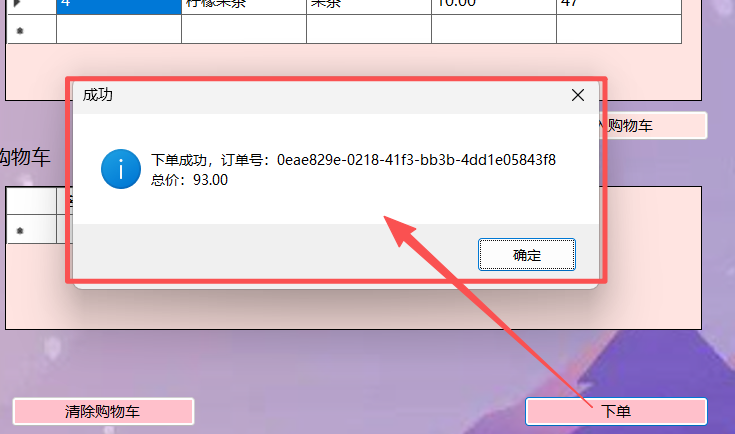
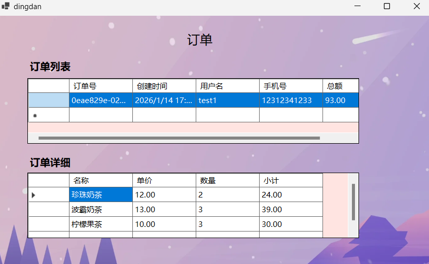

# * 自由发挥部分

对于本次大作业，我做以下部分的**自由发挥**：

1. **美术设计**：专门挑选了一些图片作为背景，并对按钮的配色进行了适配
2. user表**加入了邮箱**这个属性
3. **设计了邮箱是否合法的算法**：一个邮箱必须由“数字 + @ + 数字或字母 + . + 域名”组成
4. 在注册界面**设计**了“重复输入密码不正确”，“邮箱格式不正确”，“手机号不是11位”的**实时提示**

# 1. 完整的ER图



# 2. 所有创建表、约束SQL源码

- 创建表以及约束的sql源码都在`EnsureOracleTables()`函数中。该函数如下面代码块儿所示。
- 逻辑：每次进行操作时，程序都会检查是否存在这些表。若无，则进行初始化。

```c++
private static void EnsureOracleTables()
        {
            EnsureOracleConfigured();

            var checkUsers = "SELECT COUNT(*) FROM USER_TABLES WHERE TABLE_NAME = 'USERS'";
            var checkDrinks = "SELECT COUNT(*) FROM USER_TABLES WHERE TABLE_NAME = 'DRINKS'";
            var checkOrders = "SELECT COUNT(*) FROM USER_TABLES WHERE TABLE_NAME = 'ORDERS'";
            var checkItems = "SELECT COUNT(*) FROM USER_TABLES WHERE TABLE_NAME = 'ORDER_ITEMS'";

            var r1 = ExecuteScalar(checkUsers);
            if (r1 == "0")
            {
                ExecuteNonQuery(@"
                    CREATE TABLE USERS (
                        PHONE VARCHAR2(11) PRIMARY KEY,
                        USERNAME VARCHAR2(100),
                        PASSWORD VARCHAR2(200),
                        EMAIL VARCHAR2(200),
                        ADDRESS VARCHAR2(200),
                        CONSTRAINT chk_phone CHECK (REGEXP_LIKE(PHONE, '^[0-9]{11}$'))
                    )");
            }
            var r2 = ExecuteScalar(checkDrinks);
            if (r2 == "0")
            {
                ExecuteNonQuery(@"
                    CREATE TABLE DRINKS (
                        ID VARCHAR2(50) PRIMARY KEY,
                        NAME VARCHAR2(200),
                        CATEGORY VARCHAR2(100),
                        PRICE NUMBER(12,2) CHECK (PRICE > 0),
                        STOCK NUMBER CHECK (STOCK >= 0)
                    )");
            }
            var r3 = ExecuteScalar(checkOrders);
            if (r3 == "0")
            {
                ExecuteNonQuery(@"
                    CREATE TABLE ORDERS (
                        ID VARCHAR2(100) PRIMARY KEY,
                        USERNAME VARCHAR2(100),
                        PHONE VARCHAR2(11),
                        CREATEDAT TIMESTAMP,
                        TOTAL NUMBER(12,2) CHECK (TOTAL >= 0),
                        CONSTRAINT fk_order_user FOREIGN KEY (PHONE) REFERENCES USERS(PHONE)
                    )");
            }
            var r4 = ExecuteScalar(checkItems);
            if (r4 == "0")
            {
                ExecuteNonQuery(@"
                    CREATE TABLE ORDER_ITEMS (
                        ORDERID VARCHAR2(100),
                        DRINKID VARCHAR2(50),
                        DRINKNAME VARCHAR2(200),
                        UNITPRICE NUMBER(12,2),
                        QUANTITY NUMBER,
                        PRIMARY KEY (ORDERID, DRINKID),
                        CONSTRAINT fk_item_order FOREIGN KEY (ORDERID) REFERENCES ORDERS(ID),
                        CONSTRAINT fk_item_drink FOREIGN KEY (DRINKID) REFERENCES DRINKS(ID),
                        CONSTRAINT chk_quantity CHECK (QUANTITY >= 1)
                    )");
            }
        }
```

- 单独提取出的sql源码如下所示：

```sql
CREATE TABLE USERS (
                        PHONE VARCHAR2(11) PRIMARY KEY,
                        USERNAME VARCHAR2(100),
                        PASSWORD VARCHAR2(200),
                        EMAIL VARCHAR2(200),
                        ADDRESS VARCHAR2(200),
                        CONSTRAINT chk_phone CHECK (REGEXP_LIKE(PHONE, '^[0-9]{11}$'))
					)
					
CREATE TABLE DRINKS (
                        ID VARCHAR2(50) PRIMARY KEY,
                        NAME VARCHAR2(200),
                        CATEGORY VARCHAR2(100),
                        PRICE NUMBER(12,2) CHECK (PRICE > 0),
                        STOCK NUMBER CHECK (STOCK >= 0)
                    )
                    
CREATE TABLE ORDERS (
                        ID VARCHAR2(100) PRIMARY KEY,
                        USERNAME VARCHAR2(100),
                        PHONE VARCHAR2(11),
                        CREATEDAT TIMESTAMP,
                        TOTAL NUMBER(12,2) CHECK (TOTAL >= 0),
                        CONSTRAINT fk_order_user FOREIGN KEY (PHONE) REFERENCES USERS(PHONE)
                    )
     
CREATE TABLE ORDER_ITEMS (
                        ORDERID VARCHAR2(100),
                        DRINKID VARCHAR2(50),
                        DRINKNAME VARCHAR2(200),
                        UNITPRICE NUMBER(12,2),
                        QUANTITY NUMBER,
                        PRIMARY KEY (ORDERID, DRINKID),
                        CONSTRAINT fk_item_order FOREIGN KEY (ORDERID) REFERENCES ORDERS(ID),
                        CONSTRAINT fk_item_drink FOREIGN KEY (DRINKID) REFERENCES DRINKS(ID),
                        CONSTRAINT chk_quantity CHECK (QUANTITY >= 1)
                    )
```


# 3. 核心功能的代码片段及逻辑说明

- 注：为了逻辑清晰，这里没有进行截图，而是给出具体代码片段。（这些代码都在`23330159/Data/DataStore.cs`中）

## 3.1 用户注册以及写入数据库的相关逻辑

```c#
public static void SaveUsers(List<User> users)
        {
            EnsureOracleConfigured();
            try
            {
                LogDebug("SaveUsers: using Oracle");
                EnsureOracleTables();
                using (var con = new OracleConnection(OracleConn))
                {
                    con.Open();
                    LogDebug("SaveUsers: connection opened");
                    using (var tx = con.BeginTransaction())
                    using (var cmd = con.CreateCommand())
                    {
                        cmd.Transaction = tx;
                        cmd.CommandText = "DELETE FROM USERS";
                        cmd.ExecuteNonQuery();

                        cmd.CommandText = "INSERT INTO USERS (PHONE, USERNAME, PASSWORD, EMAIL, ADDRESS) VALUES (:phone, :uname, :pwd, :email, :addr)";
                        cmd.BindByName = true;
                        foreach (var u in users)
                        {
                            cmd.Parameters.Clear();
                            cmd.Parameters.Add(new OracleParameter("phone", OracleDbType.Varchar2) { Value = u.PhoneNumber ?? string.Empty });
                            cmd.Parameters.Add(new OracleParameter("uname", OracleDbType.Varchar2) { Value = u.Username ?? string.Empty });
                            cmd.Parameters.Add(new OracleParameter("pwd", OracleDbType.Varchar2) { Value = u.Password ?? string.Empty });
                            cmd.Parameters.Add(new OracleParameter("email", OracleDbType.Varchar2) { Value = u.Email ?? string.Empty });
                            cmd.Parameters.Add(new OracleParameter("addr", OracleDbType.Varchar2) { Value = u.Address ?? string.Empty });
                            cmd.ExecuteNonQuery();
                        }

                        tx.Commit();
                    }
                }
            }
            catch (Exception ex)
            {
                LogDebug("SaveUsers: Oracle error -> " + ex.ToString());
                throw;
            }
        }
```

**逻辑说明：**

该函数的主要功能是将用户列表数据完整持久化到Oracle数据库中，实现用户注册信息的存储。具体执行流程如下：

1. **数据库连接准备**：通过`EnsureOracleConfigured()`确保Oracle连接配置已初始化，包括连接字符串、表结构等。
2. **清空现有数据**：在执行任何插入操作前，首先执行`DELETE FROM USERS`语句，将USERS表中的所有现有记录清空。这意味着此函数实际上是全量替换用户数据，而不是增量更新。
3. **批量插入用户数据**：
   - 使用参数化查询（防止SQL注入）逐条插入用户记录
   - 每个用户对象包含五个字段：手机号(PHONE)、用户名(USERNAME)、密码(PASSWORD)、邮箱(EMAIL)、地址(ADDRESS)
   - 对每个字段都进行空值检查，如果为空则插入空字符串
4. **事务管理**：所有数据库操作（清空表和插入数据）都封装在一个事务中，确保数据一致性。如果中间任何步骤出错，所有更改都会回滚。
5. **错误处理**：如果发生任何异常，函数会记录详细的错误日志并重新抛出异常，确保调用方能够处理错误。

## 3.2 用户登录逻辑函数

```c#
public static List<User> LoadUsers()
        {
            EnsureOracleConfigured();
            try
            {
                LogDebug("LoadUsers: using Oracle");
                EnsureOracleTables();
                var dt = ExecuteQuery("SELECT PHONE, USERNAME, PASSWORD, EMAIL, ADDRESS FROM USERS");
                LogDebug($"LoadUsers: query returned {dt.Rows.Count} rows");
                var users = new List<User>();
                foreach (DataRow r in dt.Rows)
                {
                    users.Add(new User
                    {
                        PhoneNumber = r["PHONE"].ToString(),
                        Username = r["USERNAME"].ToString(),
                        Password = r["PASSWORD"].ToString(),
                        Email = r["EMAIL"].ToString(),
                        Address = r["ADDRESS"].ToString()
                    });
                }
                return users;
            }
            catch (Exception ex)
            {
                LogDebug("LoadUsers: Oracle error -> " + ex.ToString());
                throw;
            }
        }
```

**逻辑说明：**

此函数负责从Oracle数据库中加载所有用户信息，主要用于用户登录验证时的凭据比对。具体执行过程如下：

1. **数据库连接验证**：首先确保Oracle数据库连接配置正确，包括必要的表结构存在。
2. **数据查询**：执行SQL查询`SELECT PHONE, USERNAME, PASSWORD, EMAIL, ADDRESS FROM USERS`，从USERS表中获取所有用户记录。
3. **数据转换**：遍历查询结果的每一行数据记录，将数据库字段映射到User对象：
   - 从"PHONE"字段获取用户手机号
   - 从"USERNAME"字段获取用户名
   - 从"PASSWORD"字段获取密码（通常应为哈希值，而非明文）
   - 从"EMAIL"字段获取邮箱地址
   - 从"ADDRESS"字段获取用户地址
4. **结果集构建**：将所有用户对象添加到一个List<User>集合中，返回完整的用户列表。
5. **错误处理**：记录加载过程中的任何数据库异常，确保问题可追踪。

## 3.3 用户下单的相关逻辑

```c#
public static void SaveOrders(List<Order> orders)
        {
            EnsureOracleConfigured();
            try
            {
                EnsureOracleTables();
                using (var con = new OracleConnection(OracleConn))
                {
                    con.Open();
                    using (var tx = con.BeginTransaction())
                    using (var cmd = con.CreateCommand())
                    {
                        cmd.Transaction = tx;
                        cmd.BindByName = true;

                        // Instead of deleting all orders, we will insert new ones and ensure stock updates.
                        // For simplicity here we delete and reinsert but ensure stock update happens before deletes to avoid FK issues.

                        // First, calculate stock adjustments from orders list
                        var stockAdjustments = new Dictionary<string, int>();
                        foreach (var o in orders)
                        {
                            foreach (var it in o.Items)
                            {
                                if (!stockAdjustments.ContainsKey(it.DrinkId)) stockAdjustments[it.DrinkId] = 0;
                                stockAdjustments[it.DrinkId] += it.Quantity;
                            }
                        }

                        // Apply stock reductions safely: check current stock and update
                        foreach (var kv in stockAdjustments)
                        {
                            // check current stock
                            cmd.Parameters.Clear();
                            cmd.CommandText = "SELECT STOCK FROM DRINKS WHERE ID = :id";
                            cmd.Parameters.Add(new OracleParameter("id", OracleDbType.Varchar2) { Value = kv.Key });
                            var cur = cmd.ExecuteScalar();
                            if (cur == null)
                            {
                                throw new Exception($"Drink id {kv.Key} not found when updating stock");
                            }
                            int curStock = Convert.ToInt32(cur);
                            int newStock = curStock - kv.Value;
                            if (newStock < 0) throw new Exception($"¿â´æ²»×㣺{kv.Key}");

                            // update stock
                            cmd.Parameters.Clear();
                            cmd.CommandText = "UPDATE DRINKS SET STOCK = :stock WHERE ID = :id";
                            cmd.Parameters.Add(new OracleParameter("stock", OracleDbType.Int32) { Value = newStock });
                            cmd.Parameters.Add(new OracleParameter("id", OracleDbType.Varchar2) { Value = kv.Key });
                            cmd.ExecuteNonQuery();
                        }

                        // Remove existing order items and orders, then insert current orders
                        cmd.Parameters.Clear();
                        cmd.CommandText = "DELETE FROM ORDER_ITEMS";
                        cmd.ExecuteNonQuery();
                        cmd.CommandText = "DELETE FROM ORDERS";
                        cmd.ExecuteNonQuery();

                        // Insert orders and items
                        cmd.CommandText = "INSERT INTO ORDERS (ID, USERNAME, PHONE, CREATEDAT, TOTAL) VALUES (:id, :username, :phone, :createdat, :total)";
                        foreach (var o in orders)
                        {
                            cmd.Parameters.Clear();
                            cmd.Parameters.Add(new OracleParameter("id", OracleDbType.Varchar2) { Value = o.Id });
                            cmd.Parameters.Add(new OracleParameter("username", OracleDbType.Varchar2) { Value = o.Username ?? string.Empty });
                            cmd.Parameters.Add(new OracleParameter("phone", OracleDbType.Varchar2) { Value = o.PhoneNumber ?? string.Empty });
                            cmd.Parameters.Add(new OracleParameter("createdat", OracleDbType.TimeStamp) { Value = o.CreatedAt });
                            cmd.Parameters.Add(new OracleParameter("total", OracleDbType.Decimal) { Value = o.Total });
                            cmd.ExecuteNonQuery();

                            // insert items
                            cmd.CommandText = "INSERT INTO ORDER_ITEMS (ORDERID, DRINKID, DRINKNAME, UNITPRICE, QUANTITY) VALUES (:orderid, :drinkid, :drinkname, :unitprice, :quantity)";
                            foreach (var it in o.Items)
                            {
                                cmd.Parameters.Clear();
                                cmd.Parameters.Add(new OracleParameter("orderid", OracleDbType.Varchar2) { Value = o.Id });
                                cmd.Parameters.Add(new OracleParameter("drinkid", OracleDbType.Varchar2) { Value = it.DrinkId });
                                cmd.Parameters.Add(new OracleParameter("drinkname", OracleDbType.Varchar2) { Value = it.DrinkName });
                                cmd.Parameters.Add(new OracleParameter("unitprice", OracleDbType.Decimal) { Value = it.UnitPrice });
                                cmd.Parameters.Add(new OracleParameter("quantity", OracleDbType.Int32) { Value = it.Quantity });
                                cmd.ExecuteNonQuery();
                            }

                            // restore order insert command text for next insertion
                            cmd.CommandText = "INSERT INTO ORDERS (ID, USERNAME, PHONE, CREATEDAT, TOTAL) VALUES (:id, :username, :phone, :createdat, :total)";
                        }

                        tx.Commit();
                    }
                }
            }
            catch (Exception ex)
            {
                LogDebug("SaveOrders: Oracle error -> " + ex.ToString());
                throw;
            }
        }
```

**逻辑说明：**

此函数实现了完整的订单处理流程，包括库存扣减、订单信息保存和订单项记录。这是一个典型的分布式事务处理场景，需要保证数据一致性。

**核心处理流程：**

1. **库存预计算**：
   - 首先遍历所有订单中的商品项
   - 计算每种饮料（DrinkId）的总需求量
   - 构建`stockAdjustments`字典，键为饮料ID，值为需要减少的库存总量
2. **库存检查与扣减**：
   - 对每种饮料依次检查当前库存是否充足
   - 执行查询：`SELECT STOCK FROM DRINKS WHERE ID = :id`
   - 如果库存小于需求，抛出异常"库存不足"
   - 如果库存充足，执行更新：`UPDATE DRINKS SET STOCK = :stock WHERE ID = :id`
3. **订单数据清理**：
   - 在插入新订单前，先清空ORDER_ITEMS和ORDERS表
   - 这种设计意味着系统只保留最新的一批订单，不保存历史记录
4. **订单信息插入**：
   - 插入主订单信息到ORDERS表，包含：订单ID、用户名、手机号、创建时间、总金额
   - 使用Oracle的时间戳类型存储创建时间
5. **订单明细插入**：
   - 为每个订单插入其商品项到ORDER_ITEMS表
   - 包含：订单ID、饮料ID、饮料名称、单价、数量
6. **事务一致性**：
   - 所有数据库操作都在一个事务中执行
   - 如果任何步骤失败，所有更改都会回滚，包括已更新的库存

## 3.4 查询历史订单的相关代码

```c#
public static List<Order> LoadOrders()
        {
            EnsureOracleConfigured();
            try
            {
                EnsureOracleTables();
                var dt = ExecuteQuery("SELECT ID, USERNAME, PHONE, CREATEDAT, TOTAL FROM ORDERS ORDER BY CREATEDAT DESC");
                var orders = new List<Order>();
                foreach (DataRow r in dt.Rows)
                {
                    var id = r["ID"].ToString();
                    var o = new Order { Id = id, Username = r["USERNAME"].ToString(), PhoneNumber = r["PHONE"].ToString(), CreatedAt = DateTime.Parse(r["CREATEDAT"].ToString()) };
                    if (r.Table.Columns.Contains("TOTAL") && r["TOTAL"] != DBNull.Value)
                    {
                        if (decimal.TryParse(r["TOTAL"].ToString(), out var t)) o.Total = t;
                    }
                    var itemsDt = ExecuteQuery("SELECT DRINKID, DRINKNAME, UNITPRICE, QUANTITY FROM ORDER_ITEMS WHERE ORDERID = :oid", (":oid", id));
                    foreach (DataRow ir in itemsDt.Rows)
                    {
                        o.Items.Add(new OrderItem { DrinkId = ir["DRINKID"].ToString(), DrinkName = ir["DRINKNAME"].ToString(), UnitPrice = decimal.Parse(ir["UNITPRICE"].ToString()), Quantity = int.Parse(ir["QUANTITY"].ToString()) });
                    }
                    orders.Add(o);
                }
                return orders;
            }
            catch (Exception ex)
            {
                LogDebug("LoadOrders: Oracle error -> " + ex.ToString());
                throw;
            }
        }
```

**逻辑说明：**

此函数从Oracle数据库中加载所有历史订单信息，包括订单基本信息和对应的商品明细项。

**数据加载流程：**

1. **主订单查询**：
   - 执行SQL查询：`SELECT ID, USERNAME, PHONE, CREATEDAT, TOTAL FROM ORDERS ORDER BY CREATEDAT DESC`
   - 按创建时间降序排列，确保最新订单显示在最前面
   - 从结果集中解析订单基本信息
2. **订单对象构建**：
   - 创建Order对象，设置基本属性
   - 特别注意TOTAL字段的类型转换，处理可能的空值和格式异常
   - 将创建时间字符串转换为DateTime类型
3. **订单明细查询**（N+1查询）：
   - 对每个订单，执行关联查询：`SELECT DRINKID, DRINKNAME, UNITPRICE, QUANTITY FROM ORDER_ITEMS WHERE ORDERID = :oid`
   - 参数化查询确保安全性
   - 为每个订单构建完整的商品项列表
4. **数据结构组装**：
   - 将每个订单项映射到OrderItem对象
   - 包括饮料ID、饮料名称、单价、数量
   - 将订单项添加到对应订单的Items集合中
5. **结果返回**：
   - 返回包含完整订单信息的列表
   - 每个订单对象都包含其所有商品明细

# 4. 系统运行截图

1. 登录页面

   

   当输入密码不正确时，会有如下的弹窗提示：

   

2. 注册界面

   该页面内置了**重复密码必须与密码一致的检测与提示**、**邮箱不合法的提示**、**手机号不是11位的提示**

   

   当**手机号重复时，会弹出错误窗口**，如下图

   

​	注册成功后有这样的提示：



3. 饮品菜单与点单页面：

   该页面会**显示当前用户的用户名**，提供了**分类、加入购物车、下单、查看历史订单**的功能

   

​	当选择超出库存，会显示错误



​	下单后会显示成功

​	

4. 用户历史订单查询

   在点单页面点击“查看历史订单”，便可在订单页面看到该用户的所有订单以及每笔订单包含物

   

